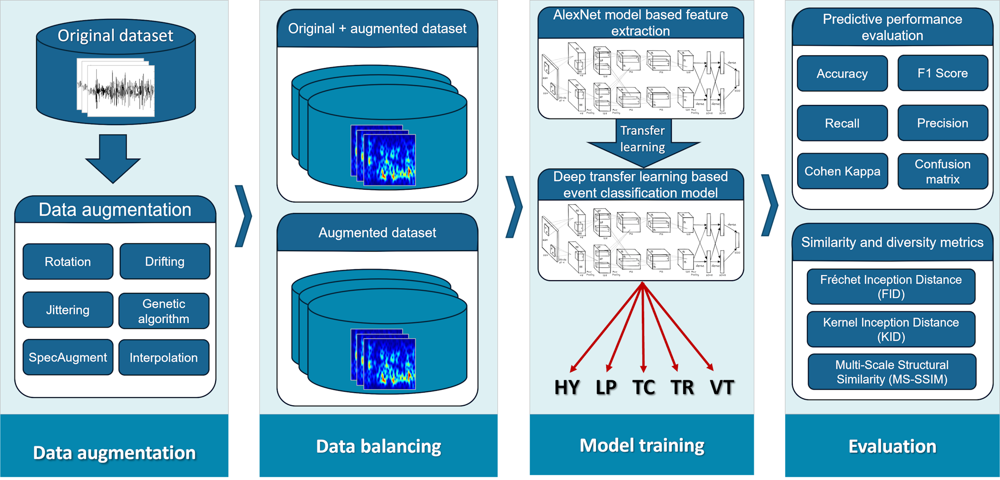

# daSeismicSignals
## Data augmentation techniques for volcanic seismic signals

This repository is related to the article:
[Evaluating data augmentation techniques in the classification of multi-station seismic-volcanic signals; Franz Yupanqui Machaca,Pablo Salazar Reinoso,Claudio Meneses Villegas] 

If you use this algorithm in your research, please cite this article.

For more information, please contact us at frayup@gmail.com

## Classification Process for Volcanic Seismic Signals
Demonstration of the event classification process, using data augmentation techniques and similarity and diversity metrics.  


## Requirements:
- Python 3.13+
- PyTorch 2.9.1+cu130+
- Obspy 1.4.2+

## Repo Tree
```
├── da
│   ├── aes
│   │   ├── AE1_ModeloCAE.pt
│   │   ├── AE2_ModeloCAE.pt
│   │   └── AE3_ModeloCAE.pt
│   ├── da_ag.py
│   ├── da_ag1.py
│   ├── da_drifting.py
│   ├── da_interpolation.py
│   ├── da_jittering.py
│   ├── da_rotacion.py
│   ├── da_rotacion1.py
│   ├── da_specaugment.py
│   └── da_specaugment1.py
├── fym
│   ├── __init__.py
│   ├── autoencoder.py
│   ├── signal.py
│   └── util.py
├── MetricasDA.ipynb
├── README.md
├── t-student.ipynb
└── tl7_esc2.ipynb
```
Additional information:
1. The “fym” folder contains the base working files, which include implemented basic functions and classes. In particular, the TSignal class—derived from ObsPy’s Stream class—implements functions for handling seismic time series, as well as fundamental operations on them and data augmentation techniques for seismic signals.
2. The “da” folder contains the code for generating augmented data for each technique, encapsulated in a corresponding Python .py file. The “aes” subfolder contains 3 .pt files, each storing the architecture and weights of a trained PyTorch autoencoder; this is required for the “AEs interpolation” data augmentation technique.
3. The root folder contains the following Jupyter Notebook (.ipynb) files:
    - MetricasDA: Calculates data similarity and diversity metrics.
    - t-student: The t-test (or Student’s t-test) to determine whether there is a significant difference between the means of two groups.
    - tl7_esc2: Model training and testing using transfer learning.

## License
This code is released for non-commercial and research purposes. For commercial use, please contact the authors.
